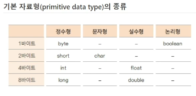
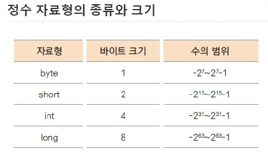

# basic_java

# 용어
- JDK (Java Development Kit) : 자바에서 제공되는 개발용 라이브러리
- JRE (Java Runtime Environment) : 자바 프로그램이 실행되는 환경
- JVM (Java Virtual Machine) : 자바 가상 머신, JRE가 설치되어 있어야함

# 자료
- 컴퓨터에서 자료 표현 (0,1)
- bit(1비트) : 컴퓨터가 표현하는 데이터의 최소 단위, 2진수 하나의 값을 저장할 수 있는 메모리 크기
- byte(바이트) : 1byte = 8bit

 
# 리터럴(literal)
- 프로그램에서 사용하는 숫자, 문자, 논리값
- 상수 영역 (constant pool)
- 정수 리터럴 int, 실수 리터럴 double 로 저장됨 

# 함수 호출, 스택 메모리
- 스택 : 함수가 호출될 때 지역 변수들이 사용하는 메모리 (함수가 끝나면 지역 변수 활용이 끝나니 스택이 해제됨)

# 인스턴스
- 실제 클래스 기반으로 생성된 객체
- 서로 다른 변수명으로 생성한 하나의 클래스는 서로 다른 메모리
- new 키워드 사용하여 인스턴스 생성

# 힙 메모리 (동적 메모리)
- 생성된 인스턴스는 힙 메모리에 할당
- 여러개의 인스턴스는 각각 다른 메모리 주소를 가짐

# 용어정리
- 객체 : 객체 지향 프로그램의 대상, 생성된 인스턴스
- 클래스 : 객체를 프로그래밍 하기 위해 코드로 정의해놓은 상태
- 인스턴스 : new 키워드를 사용하여 클래스를 메모리에 생성한 상태
- 멤버 변수 : 클래스의 속성, 특성
- 메서드 : 멤버 변수를 이용하여 클래스 기능을 구현한 함수
- 참조 변수 : 메모리에 생성된 인스턴스를 가리키는 변수
- 참조 값 : 생성된 인스턴스의 메모리 주소 값

# 생성자
- 객체 생성 시 new 키워드와 함께 사용
- 일반 함수처럼 기능을 호출하는 것이 아닌 객체 생성을 위한 new와 함께 호출
- 객체 생성 시 변수나 상수를 초기화 하거나 다른 초기화 기능을 수행하는 메서드 호출
- 반환값 없고, 클래스 이름과 동일
- 대부분 외부에서 접근 가능하지만, 필요에 의해 private로 선언되는 경우도 있음

# 기본 생성자
- 클래스에는 반드시 하나 이상의 생성자가 존재
- 클래스에 생성자 구현하지 않아도 new 키워드와 함께 생성자 호출 가능
- 클래스에 생성자 하나도 없는 경우 컴파일러가 생성자 코드를 넣어줌 (ex. public Student(){})
- 매개 변수 없음, 구현부 없음
- 별도의 생성자 구현시 기본 생성자는 제공되지 않음

# 접근 제어 지시자
- private : 같은 클래스 내부에서만
- 없음 (default) : 같은 패키지 내부에서만
- protected : 같은 패키지나 상속관계의 클래스에서만
- public : 클래스 외부 어디서나

# 정보 은닉
- private로 제어한 멤버 변수도 public 메서드가 제공되면 접근 가능
- 멤버 변수가 public으로 사용 되었을 때 보다 private 일 때 각 변수에 대한 제한을 public 메서드에서 제어 할 수 있음
- 외부에서 접근 가능한 최소한의 정보를 오픈함으로써 객체 오류 방지

# 캡슐화 (encapsulation)
- 꼭 필요한 정보와 기능만 외부에 오픈
- 대부분의 멤버 변수와 메서드 은닉, 외부에 통합된 인터페이스만 제공해 일관된 기능 구현하게 함
- 각 메서드나 멤버 변수 접근 함으로써 오류 최소화

# this
- 인스턴스 자신의 메모리를 가리킴
- 생성자가 여러개인 경우, 생성자에서 또 다른 생성자 호출 가능
- 자신의 주소(참조값)를 반환 (return this)

# static
- 여러 인스턴스에서 공통으로 사용하는 변수
- 처음 프로그램이 메모리에 로딩될 때 메모리를 할당함
- 클래스 변수, 정적 변수라고도 함 (↔ 인스턴스 변수)
- 인스턴스 생성과 상관 없이 사용 가능하므로 클래스 이름으로 직접 참조
- static 메서드 (클래스 메서드)에서는 인스턴스 변수 사용 불가

# 싱글톤 패턴(singleton pattern)
- 인스턴스가 단 한개만 생성되어야 하는 경우 사용하는 디자인 패턴
- static 변수, 메서드 활용하여 구현 가능